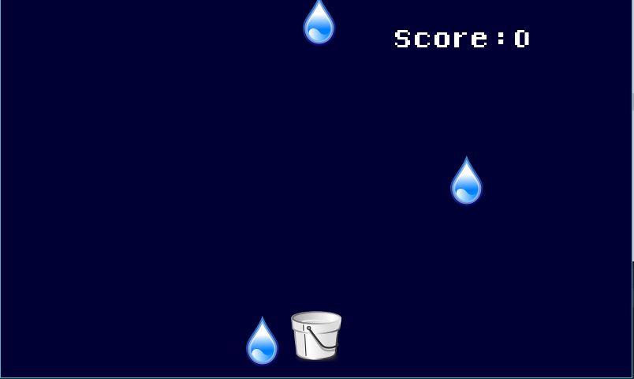

# Drop-Zen-Game  
This is a minimalist game created for both Windows and Android 
The game is pretty basic and the goal is to collect rain droplets as they fall.Users can either use a keyboard (arrow keys) or use a mouse to move the bucket.
<br/>
## Getting Started
__Windows Users__  
```Download the drop.jar in the root directory and run it.```  
<br/>
__Android Users__  
```Download the drop.apk in the root directory and run it.```
<br/>
<br/>
## Built With
- [Android Studio](https://developer.android.com/studio/) - IDE used
- [libGDX](https://libgdx.badlogicgames.com/) - Java game development framework
- [libGDX tutorial](https://github.com/libgdx/libgdx/wiki/A-simple-game) - Tutorial used to create this game
- Java [JDK-8](https://www.oracle.com/technetwork/java/javase/downloads/jdk8-downloads-2133151.html) - Language used

## Versioning
- Version 1.0 released

## To do list
- [x] Basic framework
- [ ] Add Score to Top Right/Left
- [ ] Add Lives 
- [ ] Optimize Movement Speed
- [ ] Make rain speed increase as time passes

## Screenshot  

